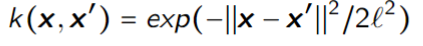
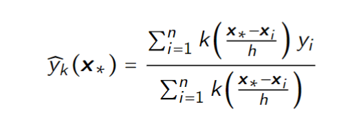
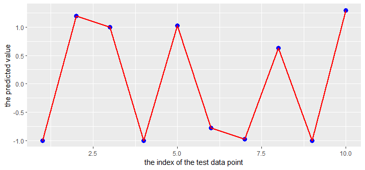
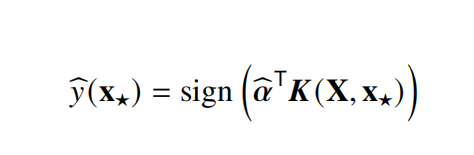
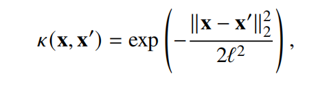
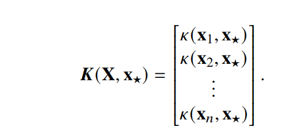

## QUESTION ONE:1. KERNEL METHODS

For doing this assignments, we have to use kernels make predictions. The first 
step for us to do is to get training data from the training data sets.
```{r,eval=FALSE}
set.seed(1234567890)
library(geosphere)
library(ggplot2)
stations <- read.csv("stations.csv")
temps <- read.csv("temps50k.csv")
st <- merge(stations,temps,by="station_number")
```

Then we need to create three functions to calculate three kinds of distances 
between the point of interest and the training point. This is very important, 
because according to the following formula, we have to get them every time we 
want to get the kernel.


Gaussian Kernel:




```{r,eval=FALSE}
distance_1 <- function(point1,point2){
  return(distHaversine(point1,as.matrix(point2,nol = 2)))
}

distance_2 <- function(date1,date2){
  days <- difftime(as.POSIXct(date1,format= "%Y-%m-%d"), 
                   as.POSIXct(date2, format = "%Y-%m-%d"),units = "days")
  return(as.numeric(days))
}


distance_3 <- function(time1,time2){
  hours <- difftime(as.POSIXct(time1,format = "%H:%M:%S"), 
                    as.POSIXct(time2,format = "%H:%M:%S"),units = "hours")
  return(as.numeric(hours))
}
```


Since we have get the functions used for calculating the distance, according to 

the following formula, we can create a corresponding function "kernel_value"





```{r}
kernel_value <- function(data1,data2,h_distance = 600000,
                         h_date = 300, h_time = 3){
  # the first kernel vector
  data_1 <- as.numeric(data1[1:2])
  data_2 <- data2[,4:5]
  kernel_1 <- exp(- distance_1(data_1,data_2)^2 / (2 * h_distance^2) )

  # the second kernel vector
  data_1 <- data1[3]
  data_2 <- data2[,9]
  kernel_2 <- exp(- distance_2(data_1,data_2)^2 / (2 * h_date^2))

  # the third kernel vector
  data_1 <-data1[4]
  data_2 <- data2[,10]
  kernel_3 <- exp(- distance_3(data_1,data_2)^2 / (2 * h_time^2))

  # conbine three kernels in different ways
  k1 <- kernel_1 + kernel_2 + kernel_3
  k2 <- kernel_1 * kernel_2 * kernel_3

  # y_hat
  yi <- data2[,11]
  y_hat_1 <- sum(k1 * yi) / sum(k1)
  y_hat_2 <- sum(k2 * yi) / sum(k2)

  return(c(y_hat_1, y_hat_2))

}
```

The final step is to use information given in the question to make prediction.
Note that when we make prediction of one particular time on one day, we should 
not ignore there are a lot of training data points that exist during the same 
day. This is the main reason why we should combine two different parts to get 
data2.

```{r,eval=FALSE}
day_times <- c("04:00:00","06:00:00","08:00:00","10:00:00","12:00:00","14:00:00"
               ,"16:00:00","18:00:00","20:00:00","22:00:00","24:00:00")

temp_one <- c()
temp_two <- c()

for(i in day_times){
  data1 <- c(" 58.4274", "14.826", "2013-11-04",i)
  # the training data consist of two parts, one part is data created before
  # the date we want to predict for. Another part is that data we collected 
  # during that day but not at the same time as that
  # we want to predict for.
  data2_part1 <- st[which(st$date < "2013-11-04"),]
  data2_part2 <- st[which(st$date == "2013-11-04" && 
                            distance_3(st$time,i) > 0),]
  data2 <- rbind(data2_part1, data2_part2)

  temp_one <- c(temp_one,kernel_value(data1,data2)[1])
  temp_two <- c(temp_two,kernel_value(data1,data2)[2])

}


data_plot <- data.frame(times = day_times, temp_1=temp_one, temp_2=temp_two)

plot1 <- ggplot(data_plot, aes(x = times, y = temp_one)) + geom_point() + 
  xlab("time") + ylab("temperature") +
  labs(title = "the kernel is the sum of the three kernels")


plot2 <- ggplot(data_plot,aes(x = times, y = temp_two)) + geom_point() + 
  xlab("time") + ylab("temperature") +
  labs(title ="the kernel is the multiply of the three kernels")

plot1
plot2
```


*


*

By comparison we can see that when we use the latter kernel(that is made by 
multiplication), the prediction result is more persuasive.


## 2. SUPPORT VECTOR MACHINES

**1. Which filter do we return to the user ? filter0, filter1, filter2 or** 
**filter3? Why?**
The filter1 should be returned to the user. The main reason is the error is the 
lowest, which means it has high precision, for making prediction.


**2. What is the estimate of the generalization error of the filter returned to** 
**the user? err0, err1, err2 or err3? Why?**

I think err1 should be returned to the user. This is because the generalization
error refers to the error we get when we use the mode to make prediction 
according to new unseen data set. Only err1 is created in this way. Namely, we 
use training data set to train the modeland then use test data set to make 
prediction.


**3. Implementation of SVM predictions.**

After calculation we can find through different methods, we find the same 
prediction. The blue dots in the graph are created with a linear combination. 
The red line is created with "predict" function.



*

To calculate the result of linear combination, we used the following formula.


*


*


*


## APPENDIX

**TASK2**

```{r,eval=FALSE}

set.seed(1234567890)
library(geosphere)
library(ggplot2)
stations <- read.csv("stations.csv")
temps <- read.csv("temps50k.csv")
st <- merge(stations,temps,by="station_number")

# create three functions to calculate three kinds of distances between 
# the point of interest and the training point.

distance_1 <- function(point1,point2){
  return(distHaversine(point1,as.matrix(point2,nol = 2)))
}

distance_2 <- function(date1,date2){
  days <- difftime(as.POSIXct(date1,format= "%Y-%m-%d"), 
                   as.POSIXct(date2, format = "%Y-%m-%d"),units = "days")
  return(as.numeric(days))
}


distance_3 <- function(time1,time2){
  hours <- difftime(as.POSIXct(time1,format = "%H:%M:%S"), 
                    as.POSIXct(time2,format = "%H:%M:%S"),units = "hours")
  return(as.numeric(hours))
}


kernel_value <- function(data1,data2,h_distance = 600000,
                         h_date = 300, h_time = 3){
  # the first kernel vector
  data_1 <- as.numeric(data1[1:2])
  data_2 <- data2[,4:5]
  kernel_1 <- exp(- distance_1(data_1,data_2)^2 / (2 * h_distance^2) )

  # the second kernel vector
  data_1 <- data1[3]
  data_2 <- data2[,9]
  kernel_2 <- exp(- distance_2(data_1,data_2)^2 / (2 * h_date^2))

  # the third kernel vector
  data_1 <-data1[4]
  data_2 <- data2[,10]
  kernel_3 <- exp(- distance_3(data_1,data_2)^2 / (2 * h_time^2))

  # conbine three kernels in different ways
  k1 <- kernel_1 + kernel_2 + kernel_3
  k2 <- kernel_1 * kernel_2 * kernel_3

  # y_hat
  yi <- data2[,11]
  y_hat_1 <- sum(k1 * yi) / sum(k1)
  y_hat_2 <- sum(k2 * yi) / sum(k2)

  return(c(y_hat_1, y_hat_2))

}

day_times <- c("04:00:00","06:00:00","08:00:00","10:00:00","12:00:00","14:00:00"
               ,"16:00:00","18:00:00","20:00:00","22:00:00","24:00:00")

temp_one <- c()
temp_two <- c()

for(i in day_times){
  data1 <- c(" 58.4274", "14.826", "2013-11-04",i)
  # the training data consist of two parts, one part is data created before
  # the date we want to predict for. Another part is that data we collected 
  # during that day but not at the same time as that we want to predict for.
  data2_part1 <- st[which(st$date < "2013-11-04"),]
  data2_part2 <- st[which(st$date == "2013-11-04" && distance_3(st$time,i) > 0),]
  data2 <- rbind(data2_part1, data2_part2)

  temp_one <- c(temp_one,kernel_value(data1,data2)[1])
  temp_two <- c(temp_two,kernel_value(data1,data2)[2])

}


data_plot <- data.frame(times = day_times, temp_1=temp_one, temp_2=temp_two)

plot1 <- ggplot(data_plot, aes(x = times, y = temp_one)) + geom_point() + 
  xlab("time") + ylab("temperature")


plot2 <- ggplot(data_plot,aes(x = times, y = temp_two)) + geom_point() + 
  xlab("time") + ylab("temperature")

plot1
plot2


```


**TASK2**
```{r,eval=FALSE}
# Lab 3 block 1 of 732A99/TDDE01/732A68 Machine Learning
# Author: jose.m.pena@liu.se
# Made for teaching purposes

library(kernlab)
set.seed(1234567890)

data(spam)
foo <- sample(nrow(spam))
spam <- spam[foo,]
spam[,-58]<-scale(spam[,-58])
tr <- spam[1:3000, ]
va <- spam[3001:3800, ]
trva <- spam[1:3800, ]
te <- spam[3801:4601, ]

by <- 0.3
err_va <- NULL
for(i in seq(by,5,by)){
  filter <- ksvm(type~.,data=tr,kernel="rbfdot",kpar=list(sigma=0.05),
                 C=i,scaled=FALSE)
  mailtype <- predict(filter,va[,-58])
  t <- table(mailtype,va[,58])
  err_va <-c(err_va,(t[1,2]+t[2,1])/sum(t))
}
# err_va
# which.min(err_va)
# seq(by,5,by)

filter0 <- ksvm(type~.,data=tr,kernel="rbfdot",kpar=list(sigma=0.05),
                C=which.min(err_va)*by,scaled=FALSE)
mailtype <- predict(filter0,va[,-58])
t <- table(mailtype,va[,58])
err0 <- (t[1,2]+t[2,1])/sum(t)
err0

# same training dataset but this is used for predicting test data set
filter1 <- ksvm(type~.,data=tr,kernel="rbfdot",kpar=list(sigma=0.05),
                C=which.min(err_va)*by,scaled=FALSE)
mailtype <- predict(filter1,te[,-58])
t <- table(mailtype,te[,58])
err1 <- (t[1,2]+t[2,1])/sum(t)
err1

# the training data set is changed into trva
filter2 <- ksvm(type~.,data=trva,kernel="rbfdot",kpar=list(sigma=0.05),
                C=which.min(err_va)*by,scaled=FALSE)
mailtype <- predict(filter2,te[,-58])
t <- table(mailtype,te[,58])
err2 <- (t[1,2]+t[2,1])/sum(t)
err2

# the training date set is changed into spam
filter3 <- ksvm(type~.,data=spam,kernel="rbfdot",kpar=list(sigma=0.05),
                C=which.min(err_va)*by,scaled=FALSE)
mailtype <- predict(filter3,te[,-58])
t <- table(mailtype,te[,58])
err3 <- (t[1,2]+t[2,1])/sum(t)
err3


sv<-alphaindex(filter3)[[1]]
co<-coef(filter3)[[1]]
inte<- - b(filter3)

support_vectors <- spam[sv,-58]
num_vector <- nrow(support_vectors)
y_hat <- c()
for(i in 1:10){
  kernel <- c()
  for (j in 1:num_vector) {
    kernel_temp <- exp(sum((support_vectors[j,] - spam[i,-58])**2) * -0.05)
    kernel <- c(kernel,kernel_temp)
  }
  y_hat_temp <- sum(t(kernel) * co) + inte
  y_hat <- c(y_hat,y_hat_temp)
}

y_hat2 <- predict(filter3,spam[1:10,-58], type = "decision")
data <- data.frame(x = 1:10, y = y_hat)
data2 <- data.frame(x = 1:10, y = y_hat2)
ggplot(data = data, aes( x = x, y = y)) + geom_point(color = "blue", size = 3) +
  geom_line(
  data = data2, color = "red", size = 1) + 
  xlab("the index of the test data point") +
  ylab("the predicted value")

```

